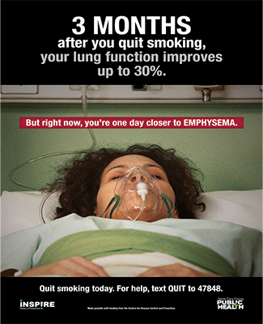

# Rhetorical Appeals (Rhetoric)

Abigail Lee - Period 3 - English

## What are the three rhetorical appeals?

| Rehetorical Appeals |                                                 What they do? |
| :------------------ | ------------------------------------------------------------: |
| Ethos               |                     Having a credibility and authority person |
| Pathos              |  Using emotions to persuade others - appeal to their emotions |
| Logos               | Using logic, reasoning, fact, and evidence to persuade others |

---

### Examples

#### Logos

In this advertisment, they use statistics to pursade their audience to stop smoking.

#### Ethos

In this commerical, having a certify dentist recommend their produce help convince their consumer to buy their product.

#### Pathos

This image is an example of pathos as they are appealing to your emotions. They are using images of a sad puppy to convince people to adopt them.

---

#### Definition

Kairos: an appeal to time ~ the right opportunity
