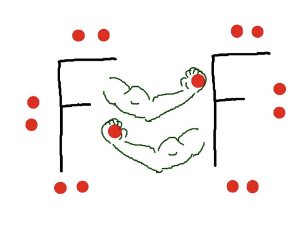
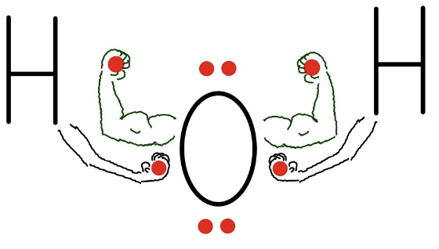
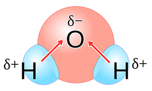
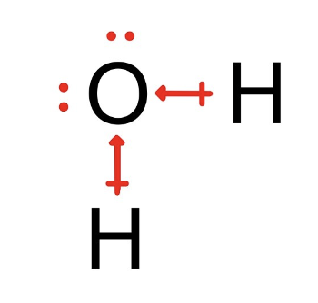

# Covalent Notes

Abigail Lee - Period 1 - Chemistry

# Polar and Nonpolar Covalent Bonds

- Electronegatvity - The measure of an atom's ability to attract the shared electrons in a covalent bonds

# Nonpolar bonds

| Nonpolar                                         | Explanation                                                                                                                    |
| ------------------------------------------------ | ------------------------------------------------------------------------------------------------------------------------------ |
|  | When there is no difference in electronegativity between the elements in a covalent bond, the atoms share the electron evenly. |

- Wheh electrons are shared evenly, they orbit the same distance from the nucleus.
- This means that one side of the bond is NOT more negative or positive than the other side of the bond.
- This situation is called a nonpolar bind. Nonpolar bonds form between atoms that have an electronegativity difference that is .4 Pauling or less.

# Polar Bonds

| Polar                                      | Explanation                                                                                                                                                                                                                                                                                    |
| ------------------------------------------ | ---------------------------------------------------------------------------------------------------------------------------------------------------------------------------------------------------------------------------------------------------------------------------------------------- |
|  | The electronegativity of oxygen is 3.5 Puling but the hyrdogen's electronegativity is only 2.1 Pauling. This means that in a water molecule, oxygen does not share the electrons evenly in its two covalently bonds with hydrogen. The shared electrons orbit closer to oxygen than hyrdrogen. |

- Polar covalent bonds have slight charges on opposite side of the bond caused by the uneven sharing of electrons.

| How polar charges are represented                 | Description                                   |
| ------------------------------------------------- | --------------------------------------------- |
|  | The first way the charges can be represented  |
|  | The second way the charges can be represented |

- Polar bonds can also result in an entire molecule becoming a polar bond.

- Requirements to be a polar molecule
  1. Must have polar covalent binds
  2. Charge of polar bonds must be asymetrical

## Overview

| Electronegativity | Type of Bonds | Sharing    |
| ----------------- | ------------- | ---------- |
| ≤ 0.4             | Nonpolar      | Equal      |
| 0.4 < and ≤ 2.0   | polar         | unequal    |
| > 2.0             | ionic         | NO sharing |
