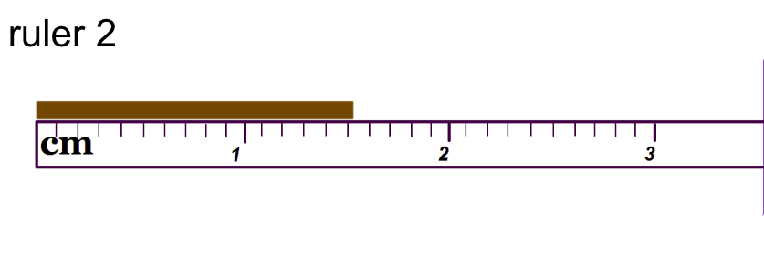

# Scientific Measurement

Abigail Lee - Period 1 - Chemistry

## Guess for ruler

Ruler 1 Guess - 1.4cm

Number one is a certain digit while four is an uncertain digit

Ruler 2 Guess- 1.52cm

Number one and five is a certain digit and two is an uncertain digit.

#### Certain and uncertain digits

- Certain digit are marked number and uncertain digit are estimation

### Golden Rule

Proper Measurement needs to have one estimated digit, no more no less

#### Precision and Accuracy

- Precision is the amount of uncertainty.
- Accuracy is how close a measurement is to the true value.

### Rules for graduated cylinders

- A graduated cylinder is a way to measure the volume of a liquid.

- Read the scale with your eyes at the level of the liquid
- Read from the bottom of the meniscus (curve)

  

  ## Important

  1. Don't try to add a specific amount!
  2. Always put the units
  3. Use laminate background to help you see the meniscus and scale marks.
